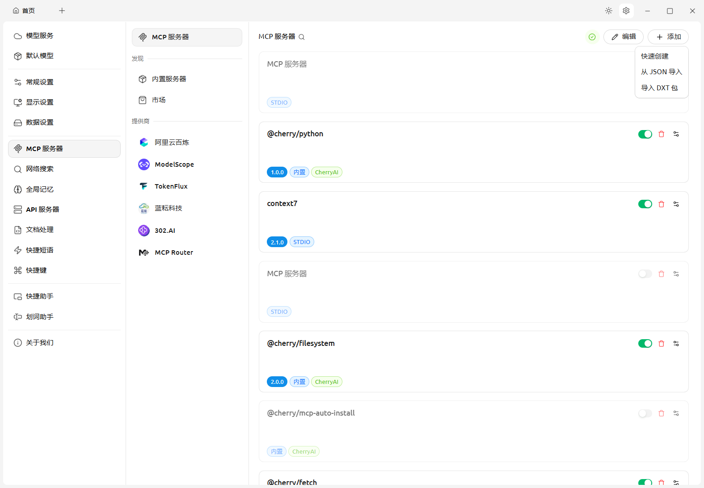
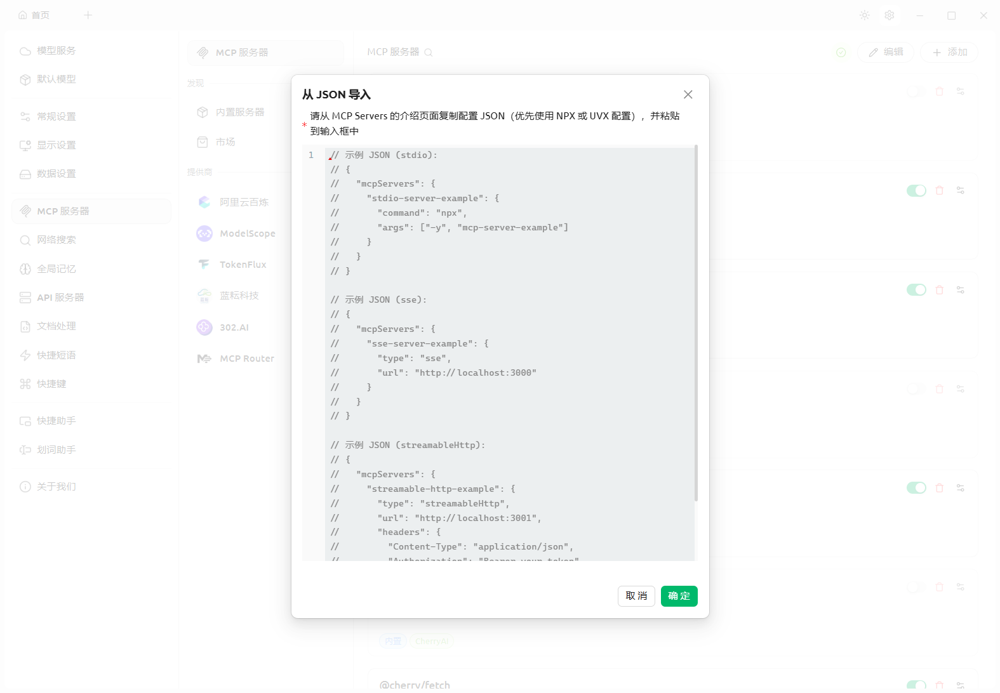
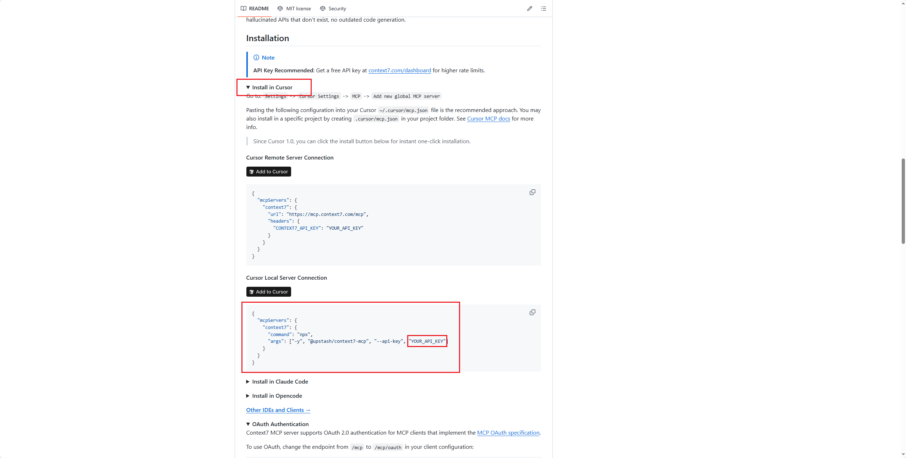
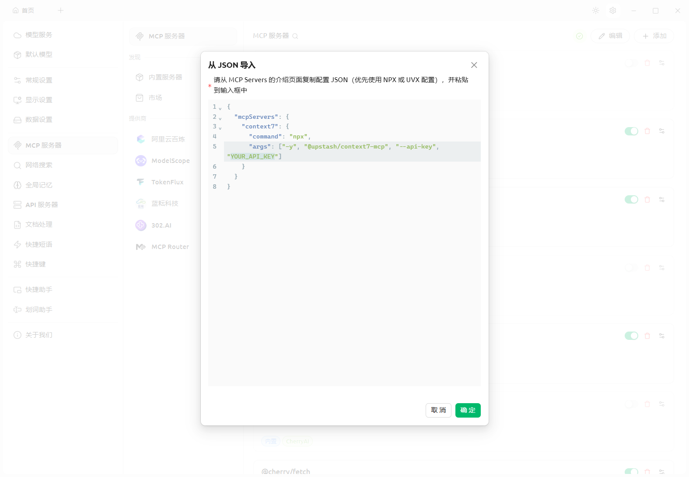

# Cherry Studio的基础知识之MCP安装教程

## 1、MCP（Model Context Protocol）是什么？

**MCP（Model Context Protocol，模型上下文协议）** 是由 **Anthropic 公司**（Claude 的开发者）于 **2024年11月** 发布并开源的一种开放协议标准。MCP 是一种专为大语言模型（LLMs）设计的上下文协议，通过标准化的语言和接口，实现 AI 模型与外部数据源/工具的无缝交互。

### 通俗理解 —— "AI 的 USB-C 接口"

官方将 MCP 比作 **AI 领域的 USB-C 接口**：

- 就像 USB-C 让不同电子设备可以用同一种接口连接各种外设
- MCP 让 AI 助手能够"即插即用"各种数据源和工具
- 实现 **"一次集成，处处运行"** 的效果

### 核心架构

MCP 采用 **客户端-服务器** 的分布式架构：

```
MCP Host（主机应用，如 Claude、Cursor）
    ↓
MCP Client（客户端）
    ↓
MCP Server（服务器）
    ↓
本地/远程数据源
```

### MCP vs Skills 核心区别

| 概念       | 定位                     | 作用                               |
| ---------- | ------------------------ | ---------------------------------- |
| **MCP**    | 工具调用的**标准化协议** | 让 AI 能"做事"（调用外部工具/API） |
| **Skills** | 业务逻辑的**知识包/SOP** | 教 AI "怎么做"（使用工具的方法论） |

## 2、分析Cherry Studio支持的MCP导入协议

我们首先分析一下Cherry Studio支持哪些MCP导入协议。





### 协议对比总览

| 协议类型           | 连接方式      | 适用场景      | 特点         |
| ------------------ | ------------- | ------------- | ------------ |
| **stdio**          | 本地进程通信  | 本地工具/CLI  | 最常用、简单 |
| **sse**            | HTTP 长连接   | 远程服务器    | 单向推送     |
| **streamableHttp** | HTTP 流式传输 | 远程服务+认证 | 功能最全     |


### 1️⃣ stdio（标准输入输出）

```json
{
  "mcpServers": {
    "stdio-server-example": {
      "command": "npx",
      "args": ["-y", "mcp-server-example"]
    }
  }
}
```

**工作原理**：
```
Cherry Studio ←→ 本地进程（stdin/stdout）
```

**配置参数**：
| 参数      | 说明         | 示例                           |
| --------- | ------------ | ------------------------------ |
| `command` | 启动命令     | `npx`、`node`、`python`        |
| `args`    | 命令参数数组 | `["-y", "mcp-server-example"]` |

**适用场景**：
- ✅ 本地 CLI 工具
- ✅ npm 包形式的 MCP Server
- ✅ 本地脚本（Python/Node.js）

**优点**：配置简单，无需网络


### 2️⃣ sse（Server-Sent Events）

```json
{
  "mcpServers": {
    "sse-server-example": {
      "type": "sse",
      "url": "http://localhost:3000"
    }
  }
}
```

**工作原理**：
```
Cherry Studio ←── HTTP 长连接 ──→ 远程 MCP Server
                 （服务器单向推送）
```

**配置参数**：
| 参数   | 说明             | 示例                    |
| ------ | ---------------- | ----------------------- |
| `type` | 协议类型（必填） | `"sse"`                 |
| `url`  | 服务器地址       | `http://localhost:3000` |

**适用场景**：
- ✅ 远程部署的 MCP 服务
- ✅ 需要实时推送的场景
- ✅ 简单的远程工具调用

**优点**：支持远程连接，实时性好


### 3️⃣ streamableHttp（流式 HTTP）

```json
{
  "mcpServers": {
    "streamable-http-example": {
      "type": "streamableHttp",
      "url": "http://localhost:3001",
      "headers": {
        "Content-Type": "application/json",
        "Authorization": "Bearer your-token"
      }
    }
  }
}
```

**工作原理**：
```
Cherry Studio ←── HTTP 流式传输 ──→ 远程 MCP Server
                 （双向通信 + 认证）
```

**配置参数**：
| 参数      | 说明             | 示例                        |
| --------- | ---------------- | --------------------------- |
| `type`    | 协议类型（必填） | `"streamableHttp"`          |
| `url`     | 服务器地址       | `http://localhost:3001`     |
| `headers` | 自定义请求头     | 认证 Token、Content-Type 等 |

**适用场景**：
- ✅ 需要身份认证的远程服务
- ✅ 企业级 API 集成
- ✅ 需要自定义 Headers 的场景

**优点**：功能最全，支持认证和自定义头


### 三种协议选择指南

```
                    ┌─────────────────┐
                    │  需要远程连接？  │
                    └────────┬────────┘
                             │
              ┌──── 否 ──────┴────── 是 ────┐
              ▼                              ▼
        ┌─────────┐               ┌─────────────────┐
        │  stdio  │               │  需要身份认证？  │
        └─────────┘               └────────┬────────┘
                                           │
                            ┌──── 否 ──────┴────── 是 ────┐
                            ▼                              ▼
                      ┌─────────┐               ┌─────────────────┐
                      │   sse   │               │ streamableHttp  │
                      └─────────┘               └─────────────────┘
```

### 实际使用建议

| 场景 | 推荐协议 | 原因 |
|------|----------|------|
| 本地文件操作工具 | **stdio** | 简单直接，无需网络 |
| 本地数据库查询 | **stdio** | 安全，数据不出本机 |
| 公开的远程 API | **sse** | 配置简单 |
| 需要 API Key 的服务 | **streamableHttp** | 支持 Authorization Header |
| 企业内部服务 | **streamableHttp** | 支持自定义认证头 |

## 3、添加MCP服务器（以context7为例）

大家可以前往**github**上查找需要的mcp服务器，下面以**context7**为例。[ Context7 MCP Server](https://github.com/upstash/context7)

**Context7** 是一款由 **Upstash** 开发的 MCP Server，专门用于为 AI 编程助手提供**实时、最新的代码文档和示例** ，应用非常广泛。




### 查看安装要求

- Node.js >= v18.0.0
- Cursor, Claude Code, VSCode, Windsurf 或其他MCP客户端
- Context7 API密钥（可选，用于更高的请求速率限制）（通过在[context7.com/dashboard](https://context7.com/dashboard)创建账户获取）

### 查找对应的JSON

1.点开**Install in Cursor**；

2.我们可以发现**stdio**协议的JSON，复制粘贴到Cherry Studio；

3.仔细一看还有一个参数需要去获取，也就是**YOUR_API_KEY**，这个需要在前文中提到。

```
{
  "mcpServers": {
    "context7": {
      "command": "npx",
      "args": ["-y", "@upstash/context7-mcp", "--api-key", "YOUR_API_KEY"]
    }
  }
}
```



## 4、总结

github上有很多有趣、高效的MCP服务器，所以大家总调侃到MCP比用MCP的人都多。

再给大家一个MCP汇总网址吧[awesome-mcp-servers](https://github.com/punkpeye/awesome-mcp-servers)，欢迎交流。
